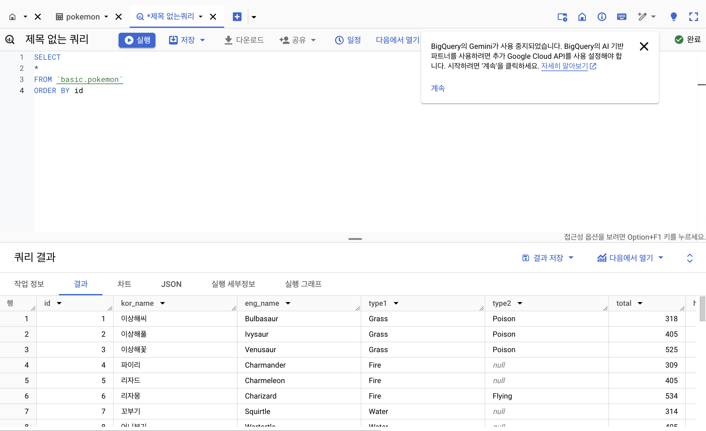
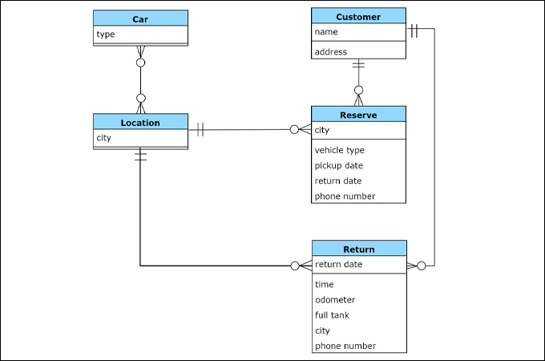
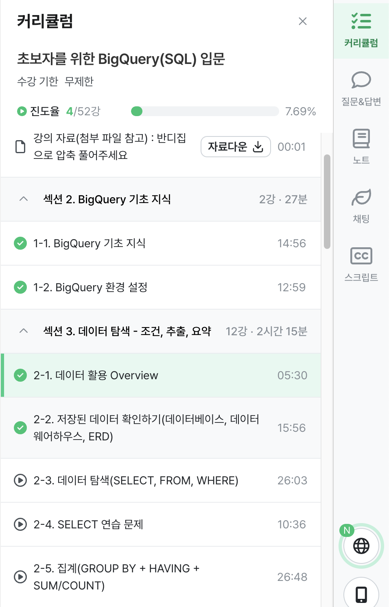

> # 1-1. BigQuery 기초 지식
---

### 데이터 저장 장소   
MySQL, Oracle, PostgreSQL 같은 데이터베이스에 주로 저장. 회사마다 다른 데이터베이스를 사용
-  OLTP(Online Transaction Processing): 거래를 하기 위해 사용되는 데이터베이스. 보류, 중간 상태가 없이 데이터가 무결함. 데이터의 추가(INSERT), 변경(UPDATE)이 많다..SQL 사용할 순 있지만 느림
### SQL(Structured Query Language)  
데이터베이스에서 데이터를 추출할 때 사용하는 언어. 데이터베이스의 데이터를 관리하기 위해 설계된 특수 목적의 프로그래밍 언어.  
쿼리문, 쿼리 구문, 쿼리를 짠다, SQL 쿼리 등으로 표현.

### OLAP(Online Analytical Processing), DW(Data Warehouse)
OLTP의 속도, 기능 부족이슈로 OLAP 등장
DW: 데이터를 한 곳에 모아서 저장.
- Database, 웹(크롤링), 파일, API의 결과 등
### BigQuery란?
Google Cloud의 OLAP + DW
- 장점
1. 난이도: SQL을 사용해 쉽게 데이터 추출 가능
2. 속도: OLAP 도구이므로 속도 빠름(단 돈이 든다)
3. Firebase, Google Analytics4의 데이터 쉽게 추출 가능. 사용 기기, 위치, OS 버전, 이벤트 행동 획득 가능
4. 데이터 웨어하우스를 사용하기 위해 서버를 띄울 필요 없이 구글에서 인프라를 관리함

### BigQuery 비용(US기준)
1. 쿼리비용: 쿼리에서 처리된 용량만큼 부과 or Slot단위로 요금 부과
2. 저장비용: 저렴함

> # 1-2. BigQuery 환경 설정
---
### BigQuery의 환경 구성 요소
1) 프로젝트: 하나의 프로젝트에 n개 데이터셋이 존재
2) 데이터셋: 하나의 데이터셋에 다양한 테이블이 존재
3) 테이블: 행, 열 데이터

> # 2-1. 데이터 활용 Overview
---
### 데이터 활용 과정
 1. 어떤 일을 해야한다
 2. 원하는 것을 정한다
 3. 데이터 탐색(단일, 다량 자료)
> 4. ***필터링, 추출, 변환, 요약***
> 5. ***데이터 결과 검증***
 6. 피드백, 활용

> # 2-2. 저장된 데이터 확인하기
---
### SQL 쿼리를 작성하기 전
- 데이터가 어떻게 저장되어 있는가?
- 어떤 데이터가 저장되어 있는가?
- 컬럼의 의미는 무엇인가?

데이터 추출 전, DW에 데이터가 어떻게 저장되어 있는지 확인해야 한다

### 데이터 저장 형태를 알려면?
- ERD(Entity Relationship Diagram): 데이터베이스 구조를 한눈에 알아보기 위해 사용.
- ERD가 없다면?  
➡️ 모든 데이터베이스를 직접 보면서 탐색: 어떤 테이블과 컬럼이 존재하는가, 어떤 컬럼을 사용하여 연결하는가, 컬럼의 값들은 어떤 의미를 가지는가.

### 포켓몬 데이터
Q. 포켓몬 세상에는 어떤 데이터가 존재할까?
- 포켓몬 : **상품**
- 트레이너 : **유저**
- 트레이너가 잡은 포켓몬 : **주문**
- 트레이너가 도전한 유저 배틀
- 트레이너가 도전한 체육관 배틀 
- NPC
- 상점
- 상점 별로 판매하는 제품

# 학습 인증
---

