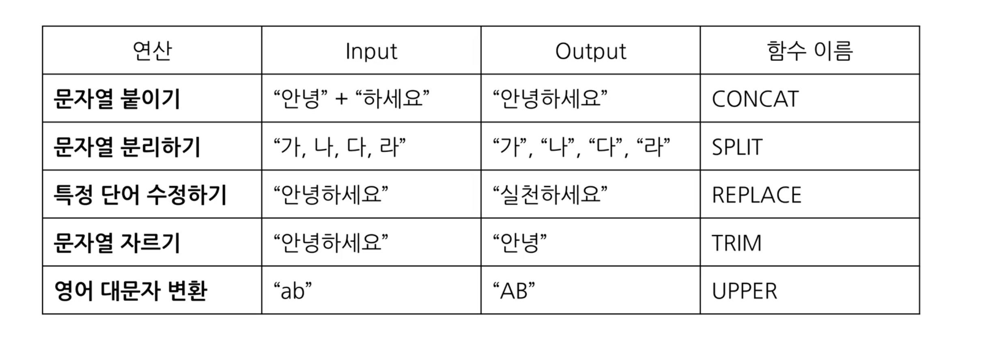
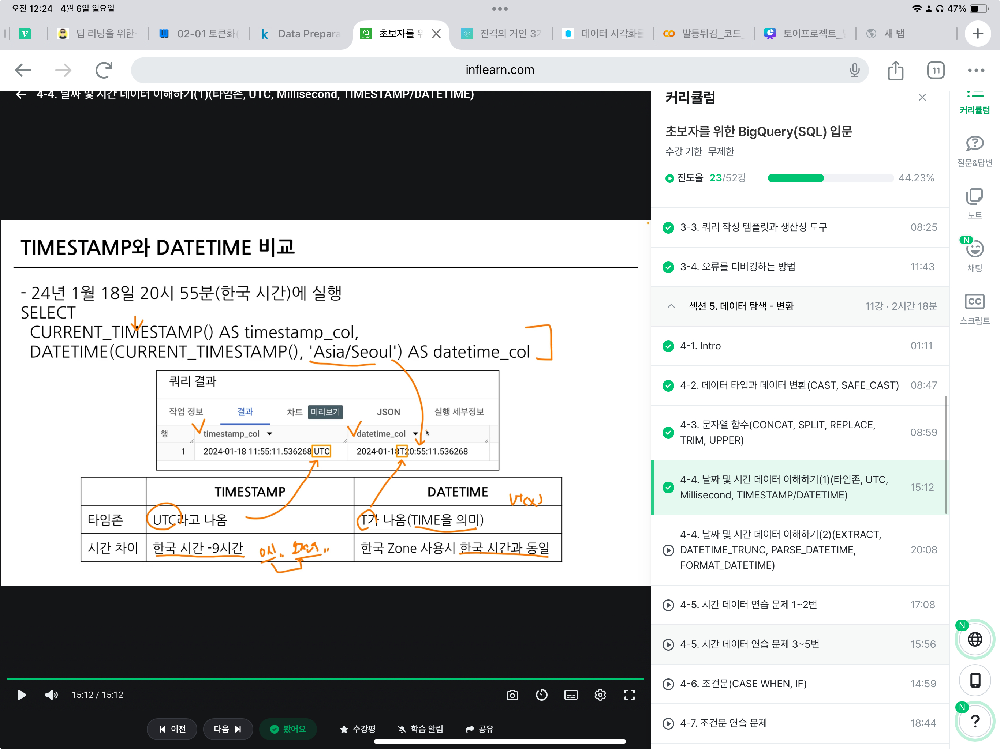

# 3-4. 오류를 디버깅하는 방법
- 오류(Error)  
현재 작성한 방식으로는 답을 얻을 수 없다 -> 어떻게 더 좋은 길로 갈까??
이 부분이 문제가 된다(문제 진단)

- Syntax Error(문법 오류)
    * 문법을 지키지 않아 생기는 오류
    * Error Message를 보고 번역, 해석한 후 해결 방법 찾아보기

- 대표적 오류
```
SELECT list must not be empty at [n:1]
# n행에서 SELECT 목록이 비어있다 -> 컬럼을 선택해야한다.
```
```
Number of arguments does not match for aggregate function COUNT
# 집계 함수 COUNT의 인자 수가 일치하지 않음.  
```
```
SELECT list expression references column type1 which is neither grouped nor aggregated at []
# SELECT 목록 식은 다음에서 그룹화되거나 집계되지 않은 열을 참조합.
# GROUP BY에 적절한 컬럼을 명시하지 않았을 경우 발생하는 오류
```
```
Expected end of input but got keyword SELECT at []
# 입력이 끝날 것으로 예상되었지만 SELECT 키워드가 입력됨.
# 하나의 쿼리에는 하나의 SELECT만
# 쿼리가 끝나는 부분에 ; 붙이고, 실행할 부분만 드래그하여 실행
```
```
Expected end of input but got keyword WHERE at []
# 입력이 끝날 것으로 예상되었지만 []에서 키워드 WHERE을 얻음
# LIMIT은 항상 쿼리 맨 끝에 작성
```
```
Syntax error: Expected ")" but got end of script at []
# ")"가 예상되지만 스크립트가 끝남
# 괄호 작성해야 함
```

**오류 메시지 해결의 핵심**
: 오류 발생 시, 오류 메시지와 함께 오류 발생. 이를 검색(구글, 공식 문서, GPT)


# Section 5 데이터 탐색 - 변환

>### 4-1. INTRO
이번 파트에서 다룰 내용:
- 데이터 탐색: 변환
    - 자료형에 따른 여러 함수 소개
    - 문자열
- 날짜 및 시간 데이터
- 조건문 함수
- BigQuery 공식 문서 확인하는 방법


>### 4-2. 데이터 타입과 데이터 변환(CAST, SAFE_CAST)
변환을 위한 함수
- Select문에서 데이터를 변환시킬 수 있음(또는 WHERE문의 조건문에서도 가능)
- **데이터 타입에** 따라 다양한 함수 존재

데이터 타입
- 숫자: 정수, 소수
- 문자
- 시간, 날짜: 2024-01-01, 2024-01-01 23:59:10
- 부울(BOOL): TRUE, FALSE
- 이외에도 여러 타입이 있음(JSON, ARRAY등)

데이터 타입이 중요한 이유: 보이는 것과 저장된 것의 차이가 존재.
- 엑셀에서 빈 값-> ""일 수도, NULL일 수도.
- 1: 숫자, 문자
- 2023-12-31: DATE, 문자
- TRUE/FALSE: 문자, BOOL

**SELECT문에서 자료 타입 변경 함수: CAST**
```
SELECT
    CAST(1 AS STRING) # 숫자 1을 문자 1로 변경

CAST("카일스쿨" AS INT64) # 문자를 숫자로 변경 불가->오류뜸

SAFE_CAST("카일스쿨" AS INT64) # 변환 실패 시 NULL 반환
```

수학 함수
- 수학 연산(평균, 표준편파, 코사인 등)

나누기를 할 경우, x/y 대신 SAFE_DIVIDE 함수 사용 cuz x, y 중 하나라도 0인 경우 그냥 나누면 zero error가 발생
SAFE_DIVIDE(x, y)


>### 4-3. 문자열 함수(CONCAT, SPLIT, REPLACE, TRIM, UPPER)
문자열: "안녕하세요", "카일스쿨"
문자열 함수의 대표적인 연산


```
# 문자열 붙이기 => CONCAT
select
  concat("안녕","하세요") as result
-- from이 없어도 CONCAT인자로 문자열이나 숫자를 넣을땐 데이터를 직접 넣어준 것
```

```
# 문자열 분리하기 => SPLIT
SELECT
    SPLIT("가, 나, 다, 라", ", ") AS result
# SPLIT(문자열_원본, 나눌 기준이 되는 문자)
```

```
# 특정 단어 수정하기 => REPLACE
SELECT
    REPLACE("안녕하세요", "안녕", "실천") AS result
# REPLACE(문자열 원본, 찾을 단어, 바꿀 단어)
```


```
# 문자열 자르기 => TRIM
SELECT
    TRIM("안녕하세요", "하세요") AS result
# TRIM(문자열 원본, 자를 단어)
```


```
# 영어 소문자를 대문자로 변경 => UPPER
SELECT
    UPPER("abc") AS Result
```


>### 4-4. 날짜 및 시간 데이터 이해하기1(타임존, UTC, Millisecond, TIMESTAMP/DATETIME) 
1) 날짜 및 시간 데이터 타입 파악: DATE, DATETIME, TIMESTAMP
2) 날짜 및 시간 데이터 관련 알면 좋은 내용: UTC, **Millisecond**
3) 날짜 및 시간 데이터 타입 변환하기
4) 시간 함수(두 시간의 차이, 특정 부분 추출하기)

* DATE, DATETIME, TIMESTAMP
    - DATE: 2023-12-31 | 날짜만 표시
    - DATETIME: 2023-12-31 14:00:00 | 날짜 + 시간 표시, TIME ZONE 표시 없음
    - TIMESTAMP: 23:59:59.00 | 시간만 표시

* 타임존
    - GMT(Greenwich Mean Time)(한국 시간: GMT +9): 영국 그리니치 천문대 기준
    - UTC(Universal Time Coordinated)(한국 시간: UTC +9): 국제적 표준 시간
        - 타임존이 존재한다 = 특정 지역의 표준 시간대
    - TIMESTAMP: UTC부터 경과한 시간을 나타내는 값. 
        - 항상 타임존이 있다
        - 2023-12-31 14:00:00 UTC

* millisecond, microsecond
    - millisecond: 1000ms=1s. 빠른 반응이 필요한 분야(개발)에서 사용
    - microsecond(μs): 1/1,000ms, 백만분의 1초
```
SELECT
    TIMESTAMP_MILLIS(1704172819711) AS milli_to_timestamp_value,
    TIMESTAMP_MICROS(1704172819711000) AS micro_to_timestamp_value,
    DATETIME(TIMESTAMP_MICROS(1704172819711000))AS datetime_value,
    DATETIME(TIMESTAMP_MICROS(1704172819711000), 'Asia/Seoul')AS datetime_value_asia;
# datetime에서는 타임존을 꼭 포함하자
# DATETIME(TIMESTAMP 정보,ZONE 정보)
```


* TIMESTAMP와 DATETIME 비교
```
SELECT
  CURRENT_TIMESTAMP() AS timestamp_col,
  DATETIME(CURRENT_TIMESTAMP(), 'Asia/Seoul') AS datetime_col;
```
    - TIMESTAME : UTC라고 나옴, 한국시간 -9
    - DATETIME : T(Time)이라고 나옴, 한국 존 사용시 한국시간과 동일


---

